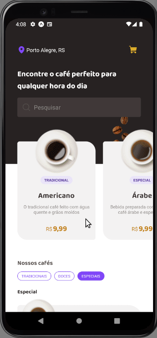
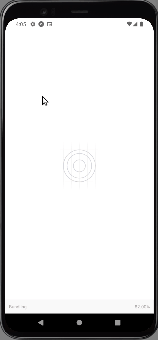

<h1 align="center">
    <p>Coffee Delivery<p>
</h1>

## Demonstração


 


<br />

## Sobre 
 
**Coffee Delivery** é um desafio proposto pela trilha ignite da rocketseat. Criei o projeto do 0 utilizando o expo e segui esse padrão de design: https://www.figma.com/file/rYgcZPcKnlHDPav6PMDkgJ/Coffee-Delivery-%E2%80%A2-Desafio-React-Native-(Community)?type=design&node-id=2-12&mode=design&t=H9rT32kJSkpiHSfD-0 

A prosta basicamente é um aplicativo delivery que vende vários tipos de café, você seleciona o que deseja põe no carrinho e fecha o pedido.

<br />

## Ferramentas

- [React Native Reanimated](https://docs.expo.dev/versions/latest/sdk/reanimated/)
- [React Native Gesture Handler](https://docs.expo.dev/versions/latest/sdk/gesture-handler/)
- [Expo Haptics](https://docs.expo.dev/versions/latest/sdk/haptics/)
- [Expo Skia](https://docs.expo.dev/versions/latest/sdk/skia/)
- [TypeScript](https://www.typescriptlang.org/)
- [React](https://reactjs.org/)
- [React Native](https://reactnative.dev/)
- [Google Fonts](https://github.com/expo/google-fonts)
- [Babel](https://babeljs.io/docs/)
- [React-Navigation](https://reactnavigation.org/docs/getting-started)
- [Phosphor Icons](https://phosphoricons.com/)
- [Expo Svg](https://docs.expo.dev/versions/latest/sdk/svg/)
- [Svg Transformer](https://github.com/kristerkari/react-native-svg-transformer)
- [AsyncStorage](https://docs.expo.dev/versions/latest/sdk/async-storage/)
- [FileSystem](https://docs.expo.dev/versions/latest/sdk/filesystem/)

<br />

## Tente você mesmo
<br />

<h3>Mobile</h3>

```bash
    # Clone ou faça download do repositório
    $ git clone https://github.com/Renatoogata/React-Native-Project05-Cofffedelivery.git
``` 

```bash
    # Instale as dependencias
    $ npm install
```

```bash
    # Conecte um dispositivo android
    $ expo start
```